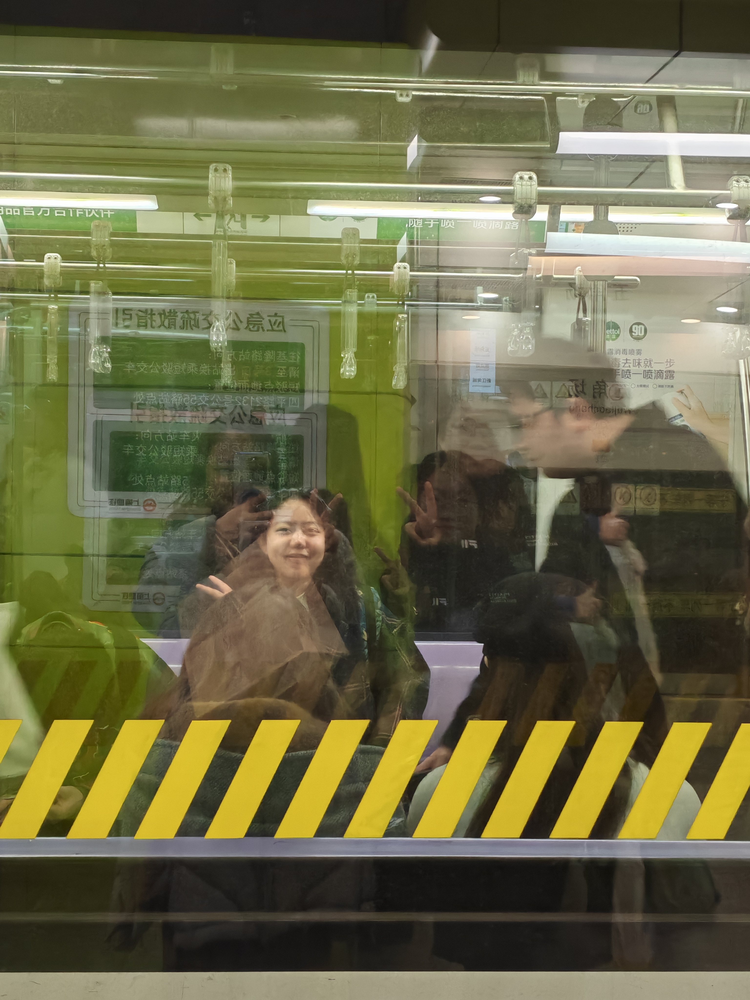
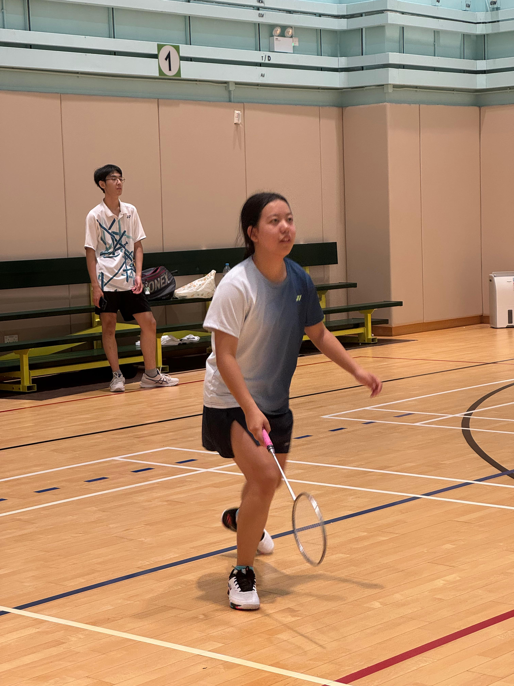

# meien.github.io
## _About Me_
  Hellooooo! My name is Wan Meien, and you can also call me Mary. I'm currently a year 2 student majoring in Electronic Engineering. 
  A little something about my hobbies: I LOVE sports! And badminton is my FAVOURITE! I also enjoy many others like tennis, table tennis, hiking and so on...

## _Why am I taking this course?_
 Well... The short answer is that I don't have enough credits and was facing the danger of underload... All other courses were either already full, or conflicts in time, or have a pre-requisite I didn't meet.
  So at the second week, I went to the Class Schedule & Quota site and found this course with very loose pre-requisite and a lot of available quota! And I surprisingly found Prof. Meng to be so young hahaha! (When I first saw his photo I thought this is a student or a TA lol)  And more surprisingly, he's got an A+ ranking on UST randkings!
  Then I just decided to enroll ASAP. 
  During the time when I was going through the course website and slides to catch on the previous ones, I was getting assured by the fun stuff the fun way that prof teaches and speaks, that I've made the right choice by enrolling into this course!

## _My expectation about the course_
  When I took ELEC1200 last semester, communication network only accounts for last few lectures'content and it made me REALLY confused with different layers and so many new concepts covered within such a short period of time. And I stll remember that these slides are filled with terminologies explained in a very professional manner such that it was hard for me to even understand the explanations!
  But this course will spend a whole semester explaining how network works so it's great! I hope I can fully understand the most important concepts and think thoroughly and don't leave any questions behind. Also, really hope that my team project can work out well haha!
